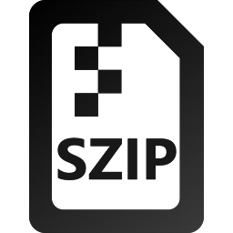

  
  <h1 align="center">SimpleZIP</h1>

<b>A very simple archiving application and hash tool for the Universal Windows Platform</b>.

 Supported formats for compression:
  - ZIP (Deflate)
  - GZIP
  - TAR (Uncompressed)
  - TAR+GZIP (=Tarball)
  - TAR+BZIP2 (=Tarball)
  - TAR+LZMA (=Tarball)
  
Supported formats for decompression:
  - ZIP
  - GZIP
  - BZIP2
  - TAR
  - TAR+GZIP
  - TAR+BZIP2
  - TAR+LZMA
  - RAR4
  - RAR5

Supported message digest algorithms:
  - MD5
  - SHA1
  - SHA256
  - SHA384
  - SHA512

 
As of the current state, this application supports encrypted archives of type ZIP and RAR4 (fully encrypted).
  
This application uses the <a href="https://github.com/adamhathcock/sharpcompress">SharpCompress</a> library and depends on its quality when it comes to reading and writing archives. Unit tests exist to test the used algorithms of this library (see project SimpleZIP_UI_TEST). In addition, starting from version 3.0 the <a href="https://github.com/icsharpcode/SharpZipLib">SharpZipLib</a> library is used as a fallback because of some issues I experienced with SharpCompress.
 

# Development requirements

The minimum requirements for this project are currently as follows:

  - Visual Studio 2019
  - Microsoft Windows 1803 (April 2018 Update)

If you are planning to fork this application you may want to change this in the project configuration file.

# Screenshots

Please refer to the store page to see some screenshots.
